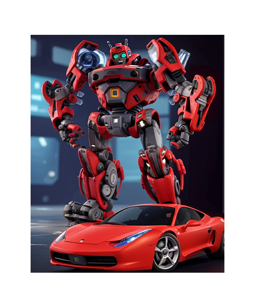
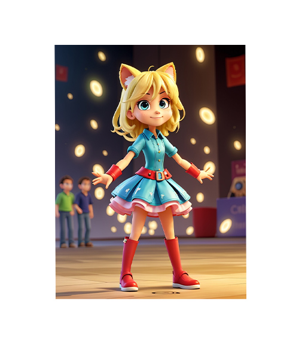

<!DOCTYPE html>
<html lang="en">

<head>
  <meta charset="utf-8">
  <meta content="width=device-width, initial-scale=1.0" name="viewport">

  <title>Devita Games</title>
  <meta content="" name="description">
  <meta content="" name="keywords">

  <!-- Favicons -->
  <link href="assets/img/favicon.png" rel="icon">
  <link href="assets/img/apple-touch-icon.png" rel="apple-touch-icon">

  <!-- Google Fonts -->
  <link href="https://fonts.googleapis.com/css?family=Open+Sans:300,300i,400,400i,600,600i,700,700i|Roboto:300,300i,400,400i,500,500i,600,600i,700,700i|Poppins:300,300i,400,400i,500,500i,600,600i,700,700i" rel="stylesheet">

  <!-- Vendor CSS Files -->
  <link href="assets/vendor/animate.css/animate.min.css" rel="stylesheet">
  <link href="assets/vendor/aos/aos.css" rel="stylesheet">
  <link href="assets/vendor/bootstrap/css/bootstrap.min.css" rel="stylesheet">
  <link href="assets/vendor/bootstrap-icons/bootstrap-icons.css" rel="stylesheet">
  <link href="assets/vendor/boxicons/css/boxicons.min.css" rel="stylesheet">
  <link href="assets/vendor/glightbox/css/glightbox.min.css" rel="stylesheet">
  <link href="assets/vendor/remixicon/remixicon.css" rel="stylesheet">
  <link href="assets/vendor/swiper/swiper-bundle.min.css" rel="stylesheet">

  <!-- Template Main CSS File -->
  <link href="assets/css/style.css" rel="stylesheet">

  
</head>

<body>

  <!-- ======= Header ======= -->
  
      <header id="header">

    
          

            
              
            
          

    
         
          <nav id="navbar" class="navbar order-last order-lg-0">
            <ul>
              <li><a href="index.html" class="active">Home</a></li>
              <!-- <li><a href="about.html">About</a></li> -->
              <!-- <li><a href="aplikasi.html">Aplikasi</a></li>
              <li><a href="client.html">Clients</a></li> -->
              <li><a href="karir.html">Carrers</a></li>
              <!-- <li><a href="contact.html">Contact</a></li> -->
            </ul>
            <i class="bi bi-list mobile-nav-toggle"></i>
          </nav>

      <!-- 

        <a href="#" class="twitter"><i class="bu bi-twitter"></i></a>
        <a href="#" class="facebook"><i class="bu bi-facebook"></i></a>
        <a href="#" class="instagram"><i class="bu bi-instagram"></i></a>
        <a href="#" class="linkedin"><i class="bu bi-linkedin"></i></i></a>
      
 -->

  </header><!-- End Header -->

  <!-- ======= Hero Section ======= -->
  <section id="hero">
    

      

        <!-- Slide 1 -->
        

          

            <!-- 

              <h2>Welcome to Kossandroid</h2>
              
Kossandroid merupakan startup dibidang game yang menyediakan mod untuk minecraft

              
<a href="" class="btn-get-started">Read More</a>

            
 -->
          

        

      

      <!-- <a class="carousel-control-prev" href="#heroCarousel" role="button" data-bs-slide="prev">
        
      </a> -->

      <!-- <a class="carousel-control-next" href="#heroCarousel" role="button" data-bs-slide="next">
        
      </a> -->

      <ol class="carousel-indicators" id="hero-carousel-indicators"></ol>

    

  </section><!-- End Hero -->

  <main id="main">

    <!-- ======= About Us Section ======= -->
    <section id="about-us" class="about-us">
      

        

          

            <h2>Selamat Datang, Bergabung Bersama Kami Untuk Meningkatkan Kreatifitasmu</h2>
            
            
          

          

            
            

              <!-- Kami adalah tim developer game indie dan aplikasi dari Indonesia yang sudah menghasilakn ratusan Aplikasi dan puluhan Game yang berfokus pada pembuatan game sederhana namun memukau hati, serta aplikasi Android yang memberikan pengalaman luar biasa bagi penggunanya. Dengan pengalaman kami yang luas dalam industri game dan teknologi, kami berkomitmen untuk menghadirkan karya-karya terbaik yang akan memenuhi kebutuhan dan keinginan pasar. -->
              Devita Ika Lestari Game and Apps Development: Membangun Dunia Digital yang Menginspirasi
Devita Ika Lestari Game and Apps Development adalah perusahaan kreatif yang fokus pada pengembangan game dan aplikasi inovatif. Sejak didirikan, kami telah berkomitmen untuk menciptakan pengalaman digital yang menghibur, mendidik, dan memukau pengguna di seluruh dunia.
            

          <!-- 

            Kami sangat memperhatikan setiap detail dalam pembuatan game dan aplikasi kami, untuk memastikan bahwa pengguna merasakan pengalaman yang memuaskan dan tak terlupakan. Kami percaya bahwa kesederhanaan adalah kunci keindahan, sehingga setiap karya kami dibuat dengan gaya minimalis namun elegan.
          
 -->
        
        

          

            
            

              

                
                Visi dan Misi:
Visi kami adalah menjadi pemimpin di industri game dan aplikasi dengan memberikan solusi kreatif yang unik dan berkualitas tinggi. Misi kami adalah mengembangkan produk yang tidak hanya memenuhi harapan klien, tetapi juga membangun hubungan jangka panjang yang kokoh dengan pengguna akhir.
Keunggulan Kami:
Inovasi Tidak Terbatas:
Dengan tim pengembang yang berdedikasi dan kreatif, kami terus mencari inovasi baru dalam setiap proyek. Dari game mobile hingga aplikasi edukatif, kami siap menghadirkan konsep-konsep segar yang membuat produk kami selalu menjadi yang terdepan.
Kualitas Tak Tertandingi:
Kami percaya bahwa kualitas adalah kunci keberhasilan. Setiap produk yang kami hasilkan melewati serangkaian pengujian ketat untuk memastikan kinerja yang optimal dan kepuasan pengguna.
Dukungan Penuh Siklus Hidup Produk:
Mulai dari konsep hingga peluncuran dan pemeliharaan produk, kami menyediakan dukungan penuh siklus hidup. Kami bekerja sama dengan klien untuk memastikan bahwa visi mereka diwujudkan dengan sempurna.
Tim Ahli Multi-disiplin:
Tim kami terdiri dari ahli di berbagai bidang, termasuk pengembangan permainan, desain UX/UI, pemrograman aplikasi, dan pengujian. Kolaborasi lintas-disiplin kami memastikan setiap aspek produk dihadirkan dengan kesempurnaan.
              

             

               Portofolio Kami:
Kami telah berhasil mengembangkan berbagai jenis game, mulai dari permainan petualangan hingga permainan edukatif yang mendidik. Aplikasi yang kami buat mencakup berbagai kebutuhan, mulai dari aplikasi bisnis hingga aplikasi kesehatan.
Klien dan Kemitraan:
Kami bangga telah bekerja dengan berbagai klien dari berbagai industri. Kemitraan kami didasarkan pada saling pengertian, transparansi, dan komunikasi yang kuat.
Lingkungan Kerja yang Kreatif:
Di Devita Ika Lestari, kami memahami bahwa lingkungan kerja yang kreatif mendukung ide-ide inovatif. Oleh karena itu, kami menciptakan tempat kerja yang mempromosikan kolaborasi, kreativitas, dan pertumbuhan profesional.
Masa Depan Bersama:
Dengan tekad yang kuat, kami siap memimpin masa depan industri game dan aplikasi. Bersama-sama, mari kita ciptakan produk yang tidak hanya memenuhi ekspektasi, tetapi juga merubah cara orang berinteraksi dengan dunia digital.
Devita Ika Lestari Game and Apps Development: Membawa Inspirasi ke Setiap Layar, Membangun Masa Depan Digital yang Luar Biasa.
             

          

        

      

    </section><!-- End About Us Section -->
  <!-- ======= aplikasi Section ======= -->
  <!-- <section id="aplikasi" class="aplikasi section-bg">
    
 

      

        <h2>Aplikasi</h2>
      

      

        

          

            

              <h4>Games</h4>
            

            

              <h3>Melon Play Ground</h3>
            

            
            
            
            
            
                
             
              <i class="bx bxs-quote-alt-right quote-icon-right"></i>
            
          

        

        

          

            

              <h4>Games</h4>
            

            

              <h3>Melon Play Ground</h3>
            

            
            
            
            
            
                
             
              <i class="bx bxs-quote-alt-right quote-icon-right"></i>
            
          

        

        

          

            

              <h4>Games</h4>
            

            

              <h3>Melon Play Ground</h3>
            

            
            
            
            
            
                
             
              <i class="bx bxs-quote-alt-right quote-icon-right"></i>
            
          

        

        

          

            

              <h4>Games</h4>
            

            

              <h3>Melon Play Ground</h3>
            

            
            
            
            
            
                
             
              <i class="bx bxs-quote-alt-right quote-icon-right"></i>
            
          

        

        
        

      
       

      

    

  </section> -->
  
  <!-- End aplikasi Section -->

  <!-- ======= Our Clients Section ======= -->
<section id="clients" class="clients">
  

    

      <h2>Partner</h2>
    

    

      <!-- 

        

          
        

      

      

        

          
        

      
 -->

      

        

          
        

      

     <!--  

        

          
        

      
 -->

      

        

          
        

      

      

        

          
        

      

      <!-- 

        

          
        

      
 -->

      <!-- 

        

          
        

      

      

        

          
        

      

      

        

          
        

      

    

  
 -->
</section><!-- End Our Clients Section -->

<!-- ======= Footer ======= -->
<footer id="footer">

  

    

      

  
        

          <h3>Devita Games</h3>
          

            Yogyakarta, Indonesia   
           
          

        

  
        

          <h4>Useful Links</h4>
          <ul>
              <li><i class="bx bx-chevron-right"></i> <a href="index.html">Home</a></li>
              <!-- <li><i class="bx bx-chevron-right"></i> <a href="about.html">About us</a></li>
              <li><i class="bx bx-chevron-right"></i> <a href="aplikasi.html">Aplikasi</a></li>
              <li><i class="bx bx-chevron-right"></i> <a href="client.html">Clients</a></li> -->
              <li><i class="bx bx-chevron-right"></i> <a href="karir.html">Careers</a></li>
            </ul>
        

  
       
  
        

          <h4>Update News letter</h4>
          
Dapatkan info menarik dari kami

          <form action="" method="post">
            <input type="email" name="email"><input type="submit" value="Subscribe">
          </form>
        

  
      

    

  

  
  

  
    

      

        &copy; Copyright <strong>Devita Games</strong>. All Rights Reserved
      

     
    
  

  </footer><!-- End Footer -->

<a href="#" class="back-to-top d-flex align-items-center justify-content-center"><i class="bi bi-arrow-up-short"></i></a>

<!-- Vendor JS Files -->

<!-- Template Main JS File -->

</body>

</html>
